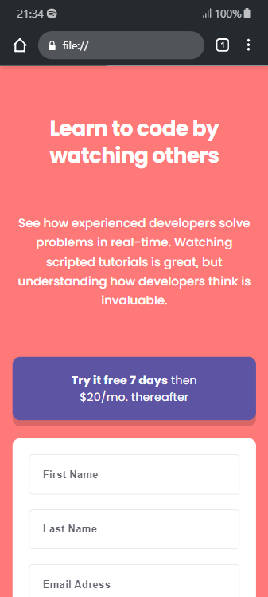

 Preview
<h1 align="center" id="title">Intro component with sign-up form.</h1>

<h2>Project Screenshots:</h2>

  
  
<h2>🧐 Features</h2>

Here're some of the project's best features:

*   Responsive intro component.
*   Sign-up validation.

  
  
<h2>💻 Built with</h2>

Technologies used in the project:

*   HTML
*   CSS
*   Vanilla Javascript
